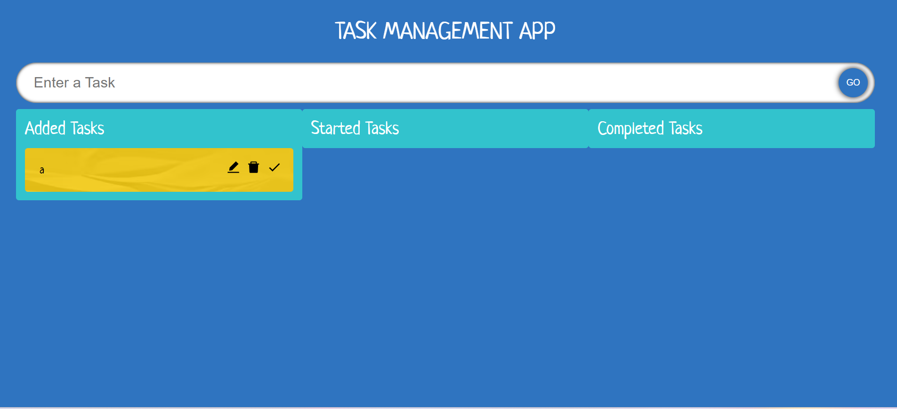

# Your React App Name

A brief description of your React app.



[Deployed_Website](https://task-management-app1.netlify.app/)

### Description
- user can 
  - add task 
  - edit task
  - delete task
  - drag and drop the task into 3 category
     - Added
     - Started
     - Completed
- task persists using local storage
- the task is categorized into 3 section
   - Added
   - Started
   - Completed

### Installation

Step-by-step instructions on how to install the required dependencies.

```bash
git clone https://github.com/GokulDev4U/Task_Management_App.git
npm install
npm start

